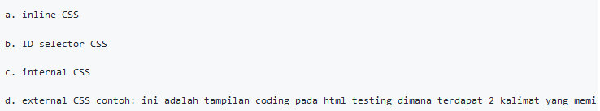

# Lab2web
untuk memenuhi tugas pemograman web

Nama    : Antini Permatasari 
Kelas   : TI.20.B.1 
Nim     : 312010095 

Pratikum 
## 1. Membuat dokumen HTML
source code untuk membuat html kira kira seperti dibawah ini :
 
jika sudah menginput, coba buka file di browser dan kira kira seperti dibawah ini :
 
## 2. Mendeklarasikan CSS Internal
source code untuk membuat CSS Internal kira kira seperti dibawah ini :
 
jika sudah ditambahkan kita buka file browser dan kira kira seperti ini :
 
## 3. Menambahkan Inline CSS
source code untuk membuat inline CS kira kira seperti dibawah ini :
 
jika sudah ditambahkan kita buka file browser dan kira kira seperti ini :
 
## 4. Membuat CSS EKsternal
source code untuk membuat nama style_ek kira kira seperti dibawah ini :
 
jika sudah ditambahkan kita buka file browser dan kira kira seperti ini :
 
## 5. Menambahkan CSS Selector
selanjutnya kita membuat source code kira kira seperti dibawah ini :
 
jika sudah ditambahkan kita buka file browser dan kira kira seperti dibawah ini :
 

Demikian step-step pembelajaran dari saya.
Maafkan jika ada kekurangan dalam step-step nya. 

## Pertanyaan dan Tugas 
1. Lakukan eksperimen dengan mengubah dan menambah properti dan nilai pada kode CSS dengan mengacu pada CSS Cheat Sheet yang diberikan pada file terpisah dari modul ini. 

Jawaban :  
 

    Apa perbedaan pendeklarasian CSS elemen h1 {...} dengan #intro h1 {...}? berikan penjelasannya!

Jawaban :

Perbedaaannya jika hanya h1{} maka akan merubah semua yang ada didalam elemen h1 sedangkan intro h1 hanya akan merubah yang memiliki tag intro.

    Apabila ada deklarasi CSS secara internal, lalu ditambahkan CSS eksternal dan inline CSS pada elemen yang sama. Deklarasi manakah yang akan ditampilkan pada browser? Berikan penjelasan dan contohnya!

Jawaban :

Jika ketiga CSS merubah elemen yang sama maka deklarasi tersebut akan mengikuti aturan prioritas dimana prioritas CSS nya seperti ini:
 
Dibawah ini sudah terdapat 2 css mencoba merubah warna text h1 :
 
Dan hasilnya seperti ini : 
 
4. 
    Pada sebuah elemen HTML terdapat ID dan Class, apabila masing-masing selector tersebut terdapat deklarasi CSS, maka deklarasi manakah yang akan ditampilkan pada browser? Berikan penjelasan dan contohnya! 

Jawaban :
 
 
 

## Sekian Dan Terimakasih.
